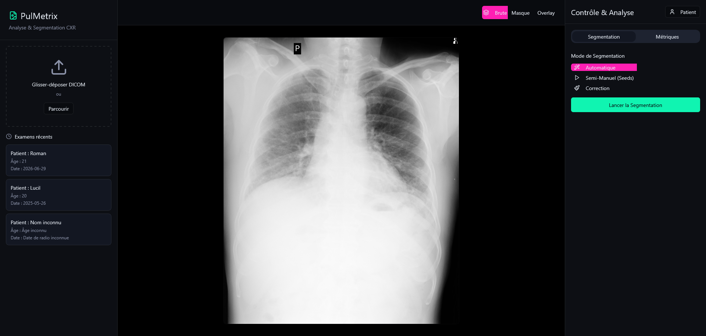
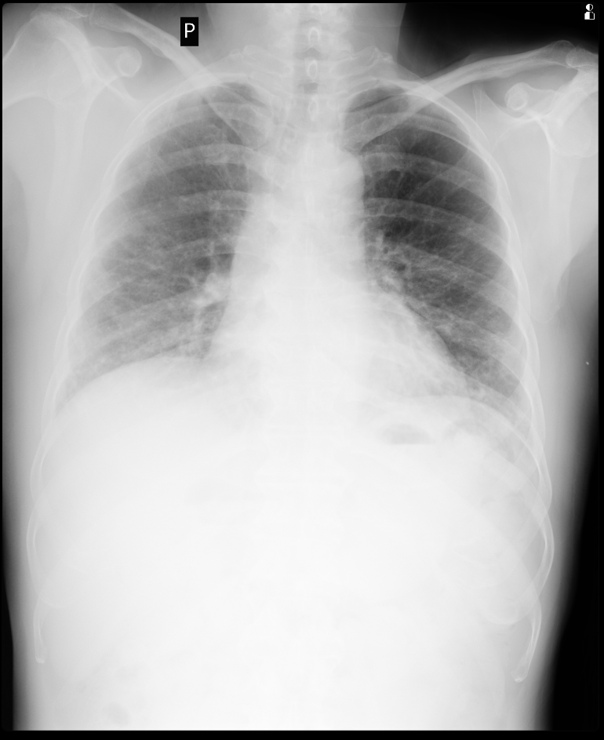
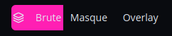
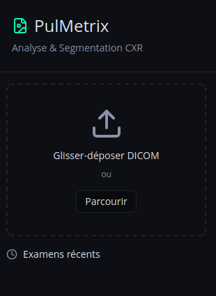
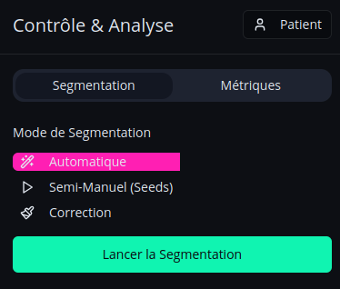
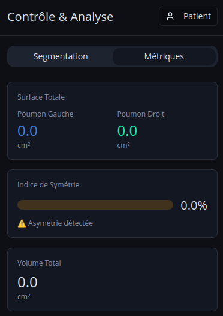
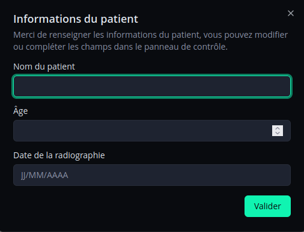

# Tutorial

## User Tutorial

The application interface is divided into 4 distinct areas. Below is a detailed description of each panel.

Here is an overview of the main interface:

## Center Panel

The central area of the application displays the medical image for the currently selected examination.

## Top Menu

This menu allows you to select the type of visualization you want to display. You can choose between the original image, the generated segmentation mask, or an overlay of both.

## Left Panel

This panel is dedicated to file management. It allows you to import a new DICOM image into the application and browse through the history of all previously processed examinations.

## Right Panel

### Segmentation Menu

This menu is used to launch the segmentation process on the selected image. You can choose between automatic mode, semi-manual mode (which requires placing seeds on both lungs), and a correction mode to manually draw on the mask.

### Metrics Menu

This section displays all the clinical metrics calculated by the application based on the analyzed image.

### Patient Information

This popup appears when you click the "Patient" button in the right panel. It allows you to enter patient details if you haven't already done so when importing the DICOM image. While providing this information is optional, please ensure you enter it before running the segmentation so that the data is properly saved in the database.